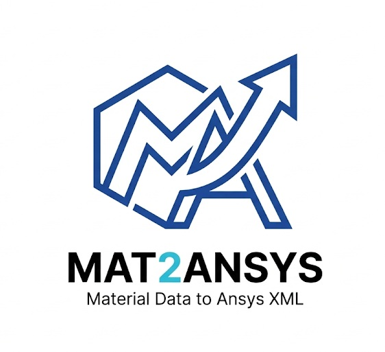

<div align="center">



# Mat2Ansys

### MatWeb → ANSYS Engineering Data Köprüsü

*MatWeb'den kopyala, ANSYS'e yapıştır. Saniyeler içinde.*

<br/>

[](https://vercel.com/new/clone?repository-url=https://github.com/Alphyn12/Mat2Ansys)
&nbsp;


</div>

---

## Nedir?

**Mat2Ansys**, malzeme mühendislerinin günlük hayatındaki en can sıkıcı işi ortadan kaldırır:
MatWeb'den ANSYS'e manuel veri girişi.

Bir malzeme sayfasındaki tüm metni kopyalayıp yapıştırmanız yeterli. Sistem otomatik olarak özellikleri çıkarır, birimleri SI'ya dönüştürür ve ANSYS Engineering Data'ya doğrudan import edilebilecek bir **MatML 3.1 XML** dosyası üretir.

> Hesap açma yok. API anahtarı yok. Sadece yapıştır ve indir.

---

## Nasıl Çalışır?

```
┌─────────────────────────────────────────────────────────────┐
│                                                             │
│   1. matweb.com → Malzemeyi bul → "Printer Friendly"       │
│                        ↓                                   │
│   2. Tüm sayfayı Ctrl+A ile kopyala                        │
│                        ↓                                   │
│   3. Mat2Ansys'e yapıştır → Malzeme adını gir → Üret       │
│                        ↓                                   │
│   4. .xml dosyasını indir → ANSYS Engineering Data'ya aktar│
│                                                             │
└─────────────────────────────────────────────────────────────┘
```

Arka planda neler oluyor:

- **Regex tabanlı ayıklama** — yapılandırılmamış MatWeb metninden özellikler çıkarılır
- **Otomatik birim dönüşümü** — MPa, GPa, ksi, psi, g/cc → SI birimleri
- **Türetilmiş özellikler** — Bulk ve Shear Modülü, E ve ν'dan hesaplanır
- **Çelik fallback değerleri** — eksik veriler endüstri standardı değerlerle tamamlanır
- **Şeffaf uyarı** — hangi değerlerin varsayılan kullanıldığı kullanıcıya gösterilir

---

## Öne Çıkan Özellikler

| Özellik | Detay |
|---|---|
| **Smart Paste** | Yapılandırılmış giriş gerekmez; tüm sayfayı yapıştır |
| **Çoklu Birim Desteği** | MPa, GPa, ksi, psi, g/cc, kg/m³, lb/in³ |
| **Aralık Değerleri** | `0.27 - 0.30` gibi değerler ortalaması alınarak işlenir |
| **Türetilmiş Modüller** | Bulk `K = E / 3(1−2ν)` · Shear `G = E / 2(1+ν)` |
| **Çelik Standart Değerleri** | E = 200 GPa · ν = 0.3 · ρ = 7850 kg/m³ |
| **Şeffaf Uyarılar** | Hangi değerlerin varsayılan kullanıldığı listelenir |
| **Sunucusuz Mimari** | Vercel uyumlu — hesap, veritabanı, API anahtarı gerektirmez |

---

## Desteklenen Malzeme Özellikleri

| MatWeb Özelliği | ANSYS Parametresi | Birim |
|---|---|---|
| Density | Yoğunluk | kg/m³ |
| Tensile Strength, Yield | Çekme Akma Dayanımı | Pa |
| Tensile Strength, Ultimate | Nihai Çekme Dayanımı | Pa |
| Modulus of Elasticity / Tensile Modulus | Young Modülü | Pa |
| Poisson's Ratio / Poissons Ratio | Poisson Oranı | — |
| *(türetilmiş)* | Bulk Modülü | Pa |
| *(türetilmiş)* | Kayma Modülü | Pa |

---

## Teknoloji Yığını

```
┌──────────────┬────────────────────────────────────────────┐
│   Katman     │   Teknoloji                                │
├──────────────┼────────────────────────────────────────────┤
│  Frontend    │  Next.js 16 · TypeScript 5 · Tailwind 4   │
│  Backend     │  FastAPI · Python 3.10+ · Pydantic         │
│  XML         │  xml.etree.ElementTree · MatML 3.1         │
│  Deploy      │  Vercel (@vercel/python + @vercel/next)    │
└──────────────┴────────────────────────────────────────────┘
```

---

## Kurulum & Yerel Geliştirme

### Gereksinimler

- Python 3.10+
- Node.js 20+

### 1 · Repoyu Klonla

```bash
git clone https://github.com/Alphyn12/Mat2Ansys.git
cd Mat2Ansys
```

### 2 · Backend'i Başlat

```bash
cd backend

# Sanal ortam oluştur
python -m venv .venv

# Aktive et
source .venv/bin/activate        # macOS / Linux
# .venv\Scripts\activate         # Windows

# Bağımlılıkları yükle
pip install -r requirements.txt

# Sunucuyu başlat
uvicorn main:app --reload --port 8000
```

### 3 · Frontend'i Başlat

```bash
cd frontend
npm install
npm run dev
```

Tarayıcıda aç → [http://localhost:3000](http://localhost:3000)

---

## Ortam Değişkenleri

### Backend — `backend/.env`

| Değişken | Varsayılan | Açıklama |
|---|---|---|
| `ALLOWED_ORIGINS` | `http://localhost:3000` | İzin verilen CORS kaynakları |
| `SEARCH_CACHE_TTL_SEC` | `86400` | Önbellek geçerlilik süresi (saniye) |
| `DISABLE_CACHE` | `0` | `1` yapılırsa önbellekleme devre dışı |

### Frontend — `frontend/.env.local`

| Değişken | Varsayılan | Açıklama |
|---|---|---|
| `NEXT_PUBLIC_API_BASE` | otomatik tespit | Backend URL (Vercel'de gerekli değil) |

---

## API Referansı

### `POST /api/parse-and-generate`

Ham MatWeb metnini ayrıştırır ve ANSYS uyumlu XML döndürür.

**İstek:**

```json
{
  "name": "AISI 4140 Steel",
  "raw_text": "<MatWeb Printer Friendly sayfasının tam metni>"
}
```

**Yanıt:** `application/xml` dosya indirme

**Özel Yanıt Başlıkları:**

| Başlık | Tür | Açıklama |
|---|---|---|
| `X-Mat2Ansys-Used-Defaults` | string (CSV) | Varsayılan kullanılan özellikler |
| `X-Mat2Ansys-Defaults-Count` | string (int) | Varsayılan kullanılan özellik sayısı |
| `X-Mat2Ansys-Missing-Or-Unparsed` | string (CSV) | Metinde bulunamayan özellikler |

### `GET /api/health`

```json
{ "status": "ok", "version": "2.0.0" }
```

---

## Proje Yapısı

```
Mat2Ansys/
│
├── backend/
│   ├── main.py              ← FastAPI uygulaması (endpoint'ler, CORS)
│   ├── utils.py             ← Regex ayıklama & birim dönüşümü
│   ├── xml_generator.py     ← MatML 3.1 XML üreteci (şablon gömülü)
│   ├── db_handler.py        ← JSON önbellek (atomik yazma, kilit yönetimi)
│   ├── security.py          ← İstek doğrulama
│   ├── requirements.txt
│   └── tests/               ← pytest birim testleri
│
├── frontend/
│   ├── app/
│   │   ├── layout.tsx       ← Kök düzen (fontlar, meta)
│   │   ├── page.tsx         ← Ana SPA (form, API çağrısı, indirme)
│   │   └── globals.css      ← Tasarım token'ları & bileşen stilleri
│   └── public/              ← Statik varlıklar (logo, rehber görselleri)
│
├── vercel.json              ← Vercel monorepo yapılandırması
└── README.md
```

---

## Vercel'e Deploy

Repo bir monorepo olarak yapılandırılmıştır. Kök dizindeki `vercel.json` her şeyi yönetir:

- `/api/*` → Python backend (FastAPI)
- `/*` → Next.js frontend

**Adımlar:**

1. Repoyu fork'la veya klonla
2. [Vercel](https://vercel.com)'e import et
3. `ALLOWED_ORIGINS` değişkenini Vercel domain'inle güncelle
4. Deploy et — başka yapılandırma gerekmez

---

## Testleri Çalıştır

```bash
cd backend
pytest
```

---

## Katkıda Bulun

```bash
# 1. Fork'la
# 2. Feature branch oluştur
git checkout -b feat/yeni-ozellik

# 3. Değişikliklerini commit'le
git commit -m "feat: yeni özellik açıklaması"

# 4. Pull request aç → master branch'e
```

---

## Lisans

[MIT](LICENSE) — Özgürce kullan, dağıt, değiştir.

---

<div align="center">

*Mühendisler için, mühendisler tarafından.*

**[mat2ansys.vercel.app](https://mat2ansys.vercel.app)**

</div>
